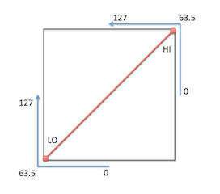
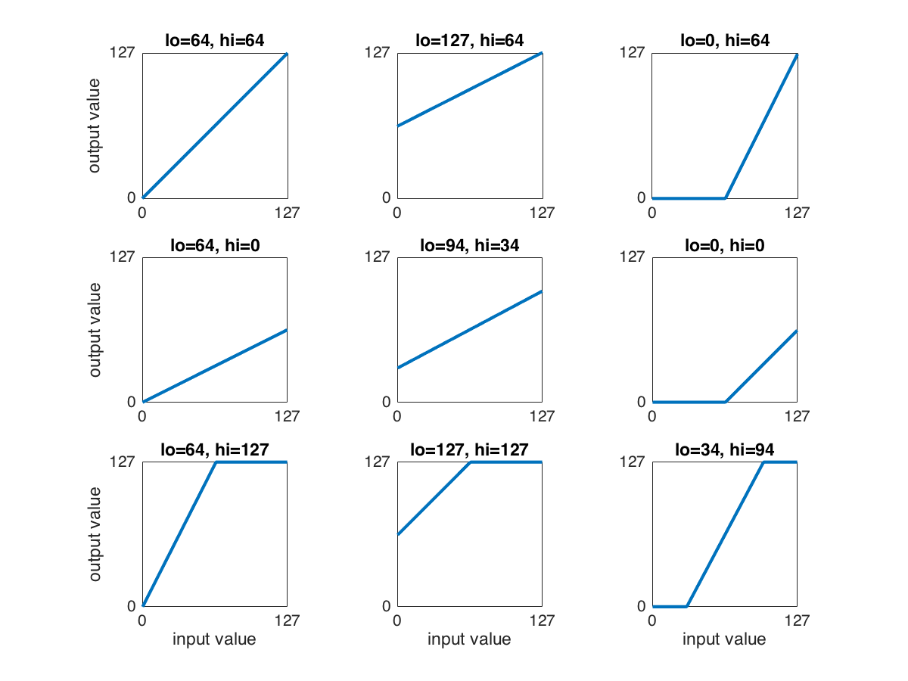

# Using the compressor/expander

The compressor/expander is implemented in the postprocessing module and allows all control values to be adjusted to the desired dynamic range.

The implementation of the compressor/expander is best explained with a figure. Along the horizontal axis you should consider the input value of the compressor/expander, along the vertical axis the output value. If there is a straight line from [0,0] to [127,127] the output is exactly the same as the input.

It uses two parameters: a "lo" and a "hi" value for the lower left and upper right corner of the figure below. The neutral settings for the "lo" and "hi" parameters are 63.5.

A too large dynamic range of the input control signal can be compressed to use a smaller part of the dynamic range of the output. Alternatively, a too small dynamic range of the input control signal can be expanded to use the full dynamic range of the output.

The "lo" and "hi" parameters can be assigned to a fixed value in the ini file. They can also be dynamically adjusted by assigning them to sliders or knobs, e.g. on the Launch Control.
