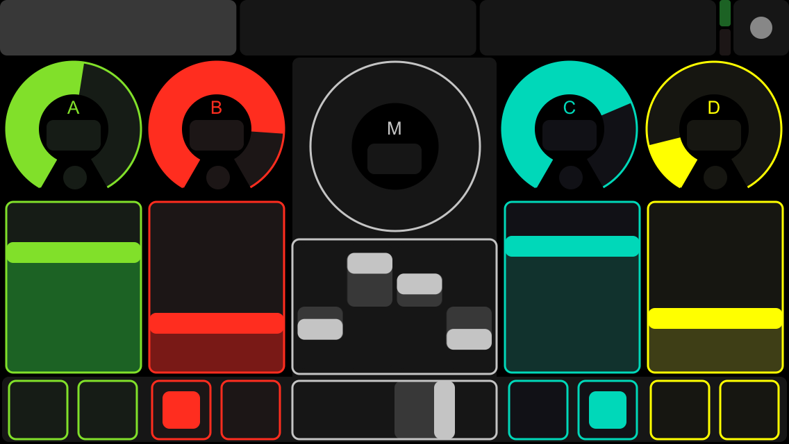

# Manual control

Although the purpose of the EEGsynth (and BCIs in general) is to control devices using biological signals, some manual interaction might be desired, e.g. to adjust the dynamics of the output or to select the frequency range of the brainsignal during the recording.
However, as with analogue synthesizers, we like the tactile real-time aspect of knobs and buttons, while avoiding using a computer keyboard. We therefor mainly use [MIDI](midi.md) controllers, such as the [LaunchControl XL](https://global.novationmusic.com/launch/launch-control-xl#) displayed below. Identical to all other modules, the [launchcontrol module](../module/launchcontrol) records the input from the LaunchControl sliders, knobs, and buttons into the Redis database to be used by other modules.

_The Novation LaunchControl XL, often used in EEGsynth setups_

## Manual control on phone or tablet

The [TouchOSC](https://hexler.net/products/touchosc) application for iOS or Android provides a modular control surface with bottons, sliders and knobs on touchscreen devices.

_Example TouchOSC interface, these can be fully configured using an editor_

## Manual control using GUI on computer

The [inputcontrol module](../module/inputcontrol) provides a configurable graphical user interface with sliders and buttons whose value is directly written to the Redis buffer.

_Continue reading: [Visualisation](visualisation.md)_
