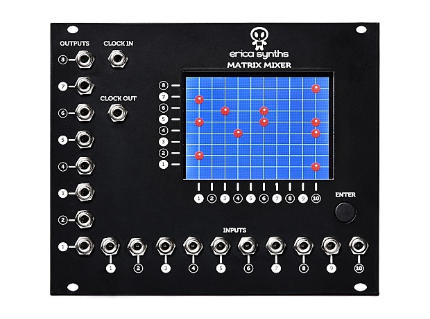

# Matrix Mixer

A matrix mixer allows flexible reconfiguration of the patching while all modules are running. 
This was already used in the [EMS VCS3](https://en.wikipedia.org/wiki/EMS_VCS_3) analog synthesizer
in 1969. Here is a more recent example of the Erica Synths 
[matrix mixer](http://www.ericasynths.lv/en/shop/eurorack-modules/by-series/basic-series/matrix-mixer/):



The [MTX9](http://www.futuresoundsystems.co.uk/mtx9.html) from Future Sound Systems is another 
nice example, which even comes with a dry-wipe marker to write the labels on the module.

In the EEGsynth the matrix mixer can be implemented using the combination of the 
[Novation Launchpad](https://novationmusic.com/launch/launchpad) and 
postprocessing modules. The corresponding postprocessing.ini would look like this

```
[input]
x11=launchpad.control000
x12=launchpad.control001
x13=launchpad.control002
x14=launchpad.control003
x15=launchpad.control004
x16=launchpad.control005
x17=launchpad.control006
x18=launchpad.control007

x21=launchpad.control016
x22=launchpad.control017
x23=launchpad.control018
x24=launchpad.control019
x25=launchpad.control020
x26=launchpad.control021
x27=launchpad.control022
x28=launchpad.control023

x31=launchpad.control032
x32=launchpad.control033
x33=launchpad.control034
x34=launchpad.control035
x35=launchpad.control036
x36=launchpad.control037
x37=launchpad.control038
x38=launchpad.control039

x41=launchpad.control048
x42=launchpad.control049
x43=launchpad.control050
x44=launchpad.control051
x45=launchpad.control052
x46=launchpad.control053
x47=launchpad.control054
x48=launchpad.control055

x51=launchpad.control064
x52=launchpad.control065
x53=launchpad.control066
x54=launchpad.control067
x55=launchpad.control068
x56=launchpad.control069
x57=launchpad.control070
x58=launchpad.control071

x61=launchpad.control080
x62=launchpad.control081
x63=launchpad.control082
x64=launchpad.control083
x65=launchpad.control084
x66=launchpad.control085
x67=launchpad.control086
x68=launchpad.control087

x71=launchpad.control096
x72=launchpad.control097
x73=launchpad.control098
x74=launchpad.control099
x75=launchpad.control100
x76=launchpad.control101
x77=launchpad.control102
x78=launchpad.control103

x81=launchpad.control112
x82=launchpad.control113
x83=launchpad.control114
x84=launchpad.control115
x85=launchpad.control116
x86=launchpad.control117
x87=launchpad.control118
x88=launchpad.control119

; input corresponds to rows of the launchpad
input1=eeg.channel1
input2=eeg.channel2
input3=eeg.channel3
input4=eeg.channel4
input5=eeg.channel5
input6=eeg.channel6
input7=eeg.channel7
input8=eeg.channel8

[output]
; output corresponds to columns of the launchpad
output1=(x11*input1+x21*input2+x31*input3+x41*input4+x51*input5+x61*input6+x71*input7+x81*input8)/(x11+x21+x31+x41+x51+x61+x71+x81)
output2=(x12*input1+x22*input2+x32*input3+x42*input4+x52*input5+x62*input6+x72*input7+x82*input8)/(x12+x22+x32+x42+x52+x62+x72+x82)
output3=(x13*input1+x23*input2+x33*input3+x43*input4+x53*input5+x63*input6+x73*input7+x83*input8)/(x13+x23+x33+x43+x53+x63+x73+x83)
output4=(x14*input1+x24*input2+x34*input3+x44*input4+x54*input5+x64*input6+x74*input7+x84*input8)/(x14+x24+x34+x44+x54+x64+x74+x84)
output5=(x15*input1+x25*input2+x35*input3+x45*input4+x55*input5+x65*input6+x75*input7+x85*input8)/(x15+x25+x35+x45+x55+x65+x75+x85)
output7=(x16*input1+x26*input2+x36*input3+x46*input4+x56*input5+x66*input6+x76*input7+x86*input8)/(x16+x26+x36+x46+x56+x66+x76+x86)
output7=(x17*input1+x27*input2+x37*input3+x47*input4+x57*input5+x67*input6+x77*input7+x87*input8)/(x17+x27+x37+x47+x57+x67+x77+x87)
output8=(x18*input1+x28*input2+x38*input3+x48*input4+x58*input5+x68*input6+x78*input7+x88*input8)/(x18+x28+x38+x48+x58+x68+x78+x88)
```

The buttons of the launchpad should be configured as toggle buttons. The "toggle1" buttons have the value 0 or 1. When two buttons in a column are pressed, the output for that column will be average of the two corresponding input channels. Using the "toggle2", "toggle3" or "toggle4" mode, you can also use fractional weighting.

Note that with the launchpad and postprocessing example above that the upper left corner is (1,1), rather than the lower left corner as the Erica Synths matrix mixer.
