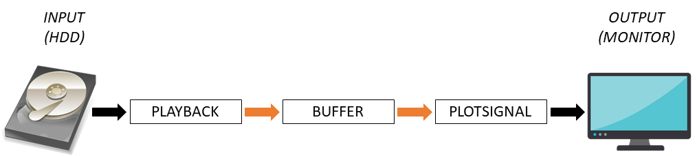

# Tutorial 1: Playback data, and display on monitor

We will start with the following setup wherein we will playback data to the buffer as if it is recorded in real-time. This is convenient, since it will allow you to develop and test your BCI without having to rely on real-time recordings.

  
*Boxes depict EEGsynth modules. Orange arrows describe time-series data. Blue arrows describe Redis data*

# Starting the data buffer

The EEGsynth uses the FieldTrip buffer to communicate data between modules. It is the place where raw (or processed) data is stored and updated with new incoming data. For more information on the FieldTrip buffer, check the [FieldTrip documentation](http://www.fieldtriptoolbox.org/development/realtime/buffer).

1.   Navigate to the buffer module directory _/eegsynth/module/buffer_
2.   Copy the _buffer.ini_ to your own ini directory (e.g. to _/eegsynth/inifiles_, which would be in _../../inifiles_ relative to the buffer module directory)
3.   Start up the buffer module, using your own ini file: _./buffer.sh -i ../../inifiles/buffer.ini_. Note here that the buffer module is one of the few modules that are an executable written in C, run from a bash script rather than Python. However, it does function exactly the same concerning the user-specific ini files.
4.   If the buffer module is running correctly, it does not print any feedback in the terminal. So no news is good news!

# Writing pre-recorded data from HDD to the buffer

We will then write some prerecorded data into the buffer as if it was being recorded in real-time:

1.   Download some example data in .edf format. For example, from our [data directory on Google Drive](https://drive.google.com/drive/folders/0B10S8PeNnxw1ZnZPbUh0RWk0cjA). Or use the data you recorded in the [recording tutorial](https://braincontrolclub.miraheze.org/wiki/Recording_tutorial "Recording tutorial").
2.   Place the .edf file in a directory, e.g. in _/eegsynth/datafiles_
3.   Navigate to the playback module directory _/eegsynth/module/playbacksignal_
4.   Copy the _playbacksignal.ini_ to your own ini directory (e.g. to _/eegsynth/inifiles_, which would be in 
_../../inifiles_ relative to the buffer module directory)
5.   Edit your _playbacksignal.ini_ to direct the playback module to the right edf data file, e.g. under ```[playback]```
 edit: ```file = ../../datafiles/testBipolar20170827-0.edf```
6.   Edit the two _playbacksignal.ini_ options for playback and rewind so that it will play back automatically 
(and not rewind): ```play=1``` and ```rewind=0```
7.   Make note that you can comment out (hide from the module) lines of text by adding a semicolon (;) at the beginning of the line
8.   Now start up the playback module, using your own .ini file: ```python playbacksignal.py -i ../../inifiles/playbacksignal.ini```
9.   If all is well, the module will print out the samples that it is 'playing back'. This is that data that is successively entered into the buffer as if was just recorded

# Plotting streaming data in the buffer

If you made it so far the buffer is working. However, we can now also read from the buffer and visualize the data as it comes in, using the plotsignal module. Note you need to be in a graphical environment for this.

1.   Navigate to the plotsignal module directory _/eegsynth/module/plotsignal_
2.   Copy the _plotsignal.ini_ to your own ini directory (e.g. to _/eegsynth/inifiles_, which would be in _../../inifiles_ relative to the buffer module directory)
3.   Edit your _plotsignal.ini_ to plot the first two channel, but editing under ```[arguments]``` edit: ```channels=1,2```
4.   Now start up the plotsignal module, using your own .ini file: ```python plotsignal.py -i ../../inifiles/plotsignal.ini```
5.   If you see your data scroll by, bravo!

_Continue reading: [Tutorial 2](tutorial2.md)_