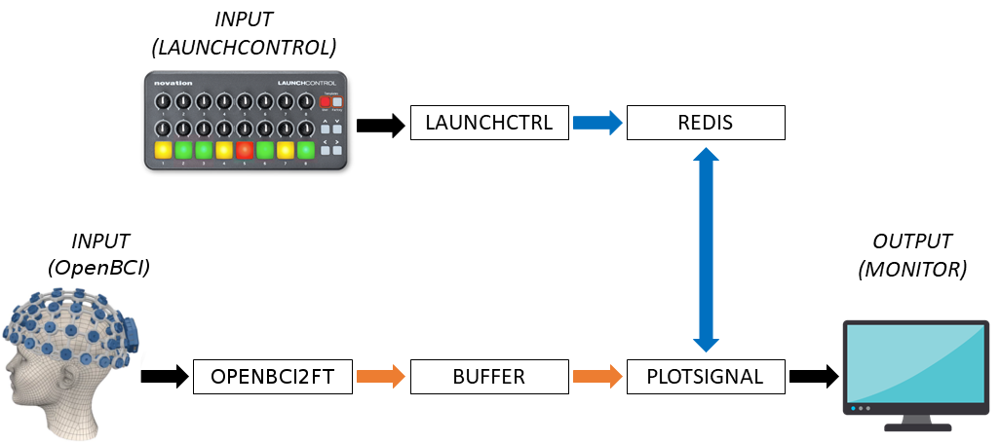

# Tutorial 3: Real-time EEG recording with OpenBCI

Now we have set up a basic pipeline in Tutorial 2, we can replace the playback of EEG with real-time recordings of EEG. 

The EEGsynth supports many EEG devices, thanks to fact that we use FieldTrip's support of EEG devices in its real-time development. 
Read the [FieldTrip realtime development documentation](http://www.fieldtriptoolbox.org/development/realtime/implementation) 
for more information. We only distribute OpenBCI, Jaga and GTec devices with the EEGsynth (and not all their devices yet). 
These modules (e.g. _openbci2ft_, _jaga2ft_ and _gtec2ft_) are written in C, because they rely on very specific interfacing 
with their devices and software. However, we use them as we would any other module, i.e. start them up with a user-specified .ini file. Similarly as the playback module, these write to the buffer. They do this typically in blocks of data that are relatively small number of samples compared to the time  we use to analyse the data and control devices.


*Boxes depict EEGsynth modules. Orange arrows describe time-series data. Blue arrows describe Redis data.*

## Setting up EEG recording

The most important lesson here is actually how to set up proper EEG recordings, but this falls outside of the scope of this tutorial. Please refer to our [recording tutorial](https://braincontrolclub.miraheze.org/wiki/Recording_tutorial "Recording tutorial") to familiarize yourself with the recording procedure first. When you did so, and got some experience (best is to do so under supervision of a more experienced EEG user), we will patch the EEG real-time recording in the pipeline of the previous tutorial, replacing the playback module with the openbci2ft module. If you are using another device, the principle will be the same.

1.   Navigate to openbci2ftmodule directory _/eegsynth/module/openbci2ft_
2.   Copy the _openbci2ft.ini_ to your own ini directory (e.g. to _/eegsynth/inifiles_, 
which would be in _../../inifiles_ relative to the openbci2ftmodule directory)
3.   We will need to plug in the OpenBCI dongle into a USB port. But before you do so, do the following:
     1.   Open a new terminal window and list the devices of the kernel, by typing 
     ```ls /dev```.
     2.   Plug in the OpenBCI dongle in a USB port
     3.   List the device again using ```ls /dev```
     4.   If you compare the two lists, you should see that another device was added after you plugged in the dongle. It will probably start with _ttyUSB_ followed with a number. This is the USB port number at which the dongle is connected. If you unplug or restart your computer, this number might change, and therefor you will probably need to do this check regularly. There might be easier ways of finding the USB port number, but this, at least, is fool-proof.

4.   Edit your openbci2ft.ini file and enter the right port name for the dongle, which you can find under [General], e.g ```serial = /dev/ttyUSB1```
5.   Start up the openbci2ft module, using your own ini file: ```python openbci2ft.py -i ../../inifiles/openbci2ft.ini```. If things are working, you the terminal will print a message that it is waiting to connect.
6.   You can now turn on the EEG board (not the dongle) by moving the little switch to either side. After a couple of second you should see the dongle starting to blink a green and red light. This means it is configuring the EEG board with the settings specified in the .ini file, which will take a couple of seconds. After that you should have your data coming in, being transferred into the fieldtrip buffer.
7.   Now you can check the incoming data with the plotsignal module.
