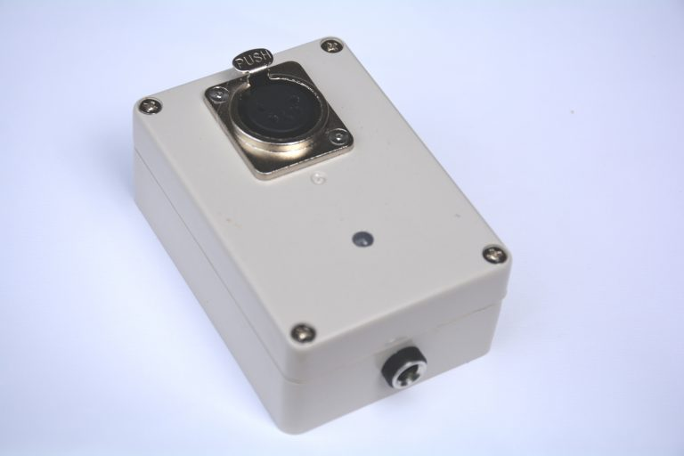
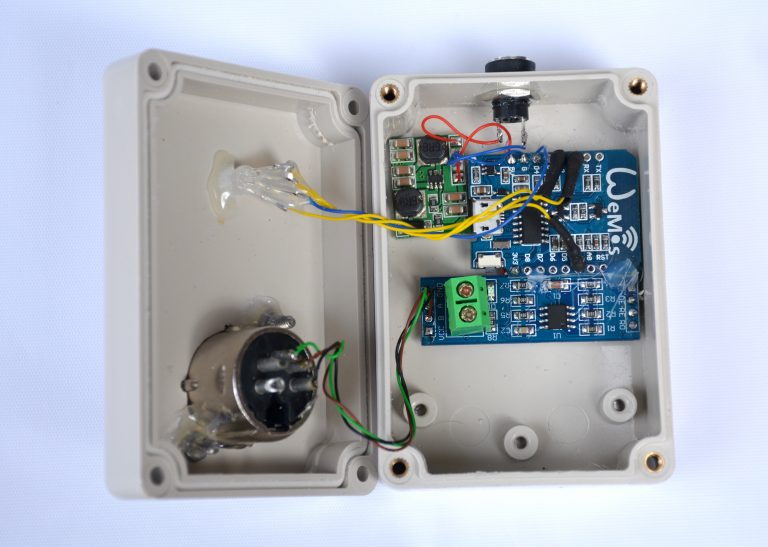

# Art-Net to DMX

This hardware module receives control signals over Art-Net (i.e. UDP packets) over a wireless connection. The Art-Net packets are passed on to a wired DMX interface. It features over-the-air (OTA) configuration of the wifi network that it connects to, configuration of the universe that is forwarded, and monitoring of the incoming packets and the frame rate.

Upon switching on, the RGB led turns yellow to indicate that setup is done. After that the led turns red to indicate that it is not connected to WiFi. It will try connect as client to the previously used WiFi network; if that succeeds, the led turns green and setup is ready. If that fails, the led remains red and the node creates a wireless access point (AP) with the name "Artnet". You can connect with your laptop or smartphone to that network to configure the WIFi client settings and provide the password of the network to which it should connect. After that it resets.

Wherever there is activity on the web interface (configuration, monitoring), the led turns blue. During web interface activity, the DMX512 output is silenced. A smooth web interface and a smooth DMX signalling don't go together.

This hardware works well with the *outputartnet* Python module.

The Arduino code for the firmware of this device can be found on [github](https://github.com/robertoostenveld/arduino/tree/master/esp8266_artnet_dmx512). More background documentation on this module can be found [here](http://robertoostenveld.nl/art-net-to-dmx512-with-esp8266/).

## Components
  - Wemos D1 mini
  - MAX485 module, e.g. http://ebay.to/2iuKQlr
  - DC-DC boost/buck converter 5V power supply, e.g. http://ebay.to/2iAfOei
  - common cathode RGB led
  - 2x 220 Ohm and 1x 100 Ohm resistors
  - 3 or 5 pin female XLR connector
  - panel mount 2.1 x 5.5 mm DC barrel jack
  - 82 x 58 x 34 mm ABS enclosure box

## Wiring scheme
 - connect 5V and GND from the power supply to Vcc and GND of the MAX485 module
 - connect 5V and GND from the power supply to the 5V and GND of the Wemos D1 mini
 - connect pin DE (data enable) of the MAX485 module to 3.3V (using 3.3V TTL)
 - connect pin RE (receive enable) of the MAX485 module to GND
 - connect pin D4/TX1 of the Wemos D1 mini to the DI (data in) pin of the MAX485 module (using 3.3V TTL)
 - connect pin A of the MAX485 module to XLR 3
 - connect pin B of the MAX485 module to XLR 2
 - connect GND                        to XLR 1
 - connect the blue  leg of the LED over the 100 Ohm resistor to GPIO16/D0
 - connect the green leg of the LED over the 220 Ohm resistor to GPIO05/D1
 - connect the red   leg of the LED over the 220 Ohm resistor to GPIO04/D2

