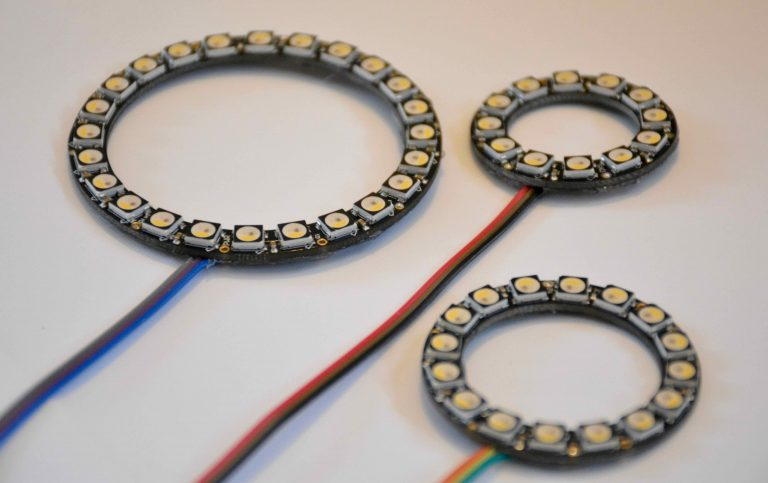
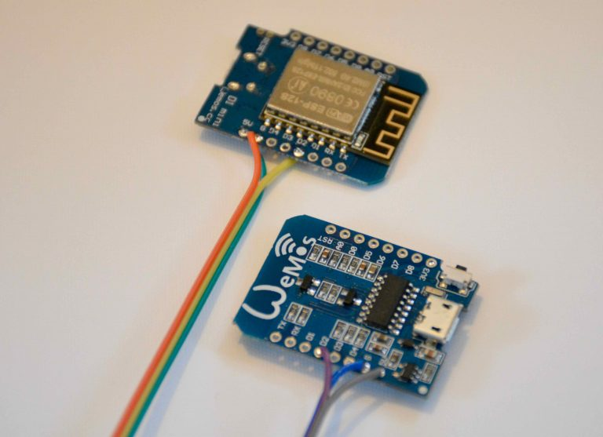

# Art-Net to Neopixel

This hardware module receives control signals over Art-Net (i.e. UDP packets) over a wireless connection. The Art-Net packets are used to drive an array of [Adafruit Neopixels](https://www.adafruit.com/category/168) or other LEDs that have a WS2812 controller in them.

This hardware works well with the *outputartnet* Python module.

We made multiple versions of this hardware, including versions that have the LEDs in a 12, 16 or 24 pixel ring (from Adafruit) or that have a long strip of LEDs (from Ebay).



The firmware supports over-the-air setup of the WiFi network and configuration in a web interface. In the configuration you can specify the number of pixels that is attached, whether they are RGBW or RGB LEDs, and allows you to select from the many different patterns.



The Arduino code for the firmware of this device can be found on [github](https://github.com/robertoostenveld/arduino/tree/master/esp8266_artnet_neopixel). More background documentation can be found [here](http://robertoostenveld.nl/esp-8266-art-net-neopixel-module/).


The pattern that is specified in the configuration determines how the Art-Net channels are mapped onto the features of the LED strip. On this [youtube](https://youtu.be/aLTDIZ6WQQQ) clip you can find an example of a specific pattern, using three different size rings and a linear strip.

## Patterns

```
  mode 0: individual pixel control
  channel 1 = pixel 1 red
  channel 2 = pixel 1 green
  channel 3 = pixel 1 blue
  channel 4 = pixel 1 white
  channel 5 = pixel 2 red
  etc.

  mode 1: single uniform color
  channel 1 = red
  channel 2 = green
  channel 3 = blue
  channel 4 = white
  channel 5 = intensity (this allows scaling a preset RGBW color with a single channel)

  mode 2: two color mixing
  channel 1  = color 1 red
  channel 2  = color 1 green
  channel 3  = color 1 blue
  channel 4  = color 1 white
  channel 5  = color 2 red
  channel 6  = color 2 green
  channel 7  = color 2 blue
  channel 8  = color 2 white
  channel 9  = intensity (this also allows to black out the colors)
  channel 10 = balance (between color 1 and color2)

  mode 3: single uniform color, blinking between the color and black
  channel 1 = red
  channel 2 = green
  channel 3 = blue
  channel 4 = white
  channel 5 = intensity
  channel 6 = speed (number of flashes per unit of time)
  channel 7 = ramp (whether there is a abrubt or more smooth transition)
  channel 8 = duty cycle (the time ratio between the color and black)

  mode 4: uniform color, blinking between color 1 and color 2
  channel 1  = color 1 red
  channel 2  = color 1 green
  channel 3  = color 1 blue
  channel 4  = color 1 white
  channel 5  = color 2 red
  channel 6  = color 2 green
  channel 7  = color 2 blue
  channel 8  = color 2 white
  channel 9  = intensity
  channel 10 = speed
  channel 11 = ramp
  channel 12 = duty cycle

  mode 5: single color slider, segment that can be moved along the array (between the edges)
  channel 1 = red
  channel 2 = green
  channel 3 = blue
  channel 4 = white
  channel 5 = intensity
  channel 6 = position (from 0-255 or 0-360 degrees, relative to the length of the array)
  channel 7 = width    (from 0-255 or 0-360 degrees, relative to the length of the array)

  mode 6: dual color slider, segment can be moved along the array (between the edges)
  channel 1  = color 1 red
  channel 2  = color 1 green
  channel 3  = color 1 blue
  channel 4  = color 1 white
  channel 5  = color 2 red
  channel 6  = color 2 green
  channel 7  = color 2 blue
  channel 8  = color 2 white
  channel 9  = intensity
  channel 10 = position (from 0-255 or 0-360 degrees, relative to the length of the array)
  channel 11 = width    (from 0-255 or 0-360 degrees, relative to the length of the array)

  mode 7: single color smooth slider, segment can be moved along the array (continuous over the edge)
  channel 1 = red
  channel 2 = green
  channel 3 = blue
  channel 4 = white
  channel 5 = intensity
  channel 6 = position (from 0-255 or 0-360 degrees, relative to the length of the array)
  channel 7 = width    (from 0-255 or 0-360 degrees, relative to the length of the array)
  channel 8 = ramp     (from 0-255 or 0-360 degrees, relative to the length of the array)

  mode 8: dual color smooth slider, segment can be moved along the array (continuous over the edge)
  channel 1  = color 1 red
  channel 2  = color 1 green
  channel 3  = color 1 blue
  channel 4  = color 1 white
  channel 5  = color 2 red
  channel 6  = color 2 green
  channel 7  = color 2 blue
  channel 8  = color 2 white
  channel 9  = intensity
  channel 10 = position (from 0-255 or 0-360 degrees, relative to the length of the array)
  channel 11 = width    (from 0-255 or 0-360 degrees, relative to the length of the array)
  channel 12 = ramp     (from 0-255 or 0-360 degrees, relative to the length of the array)

  mode 9: spinning color wheel
  channel 1 = red
  channel 2 = green
  channel 3 = blue
  channel 4 = white
  channel 5 = intensity
  channel 6 = speed
  channel 7 = width
  channel 8 = ramp

  mode 10: spinning color wheel with color background
  channel 1  = color 1 red
  channel 2  = color 1 green
  channel 3  = color 1 blue
  channel 4  = color 1 white
  channel 5  = color 2 red
  channel 6  = color 2 green
  channel 7  = color 2 blue
  channel 8  = color 2 white
  channel 9  = intensity
  channel 10 = speed
  channel 11 = width
  channel 12 = ramp

  mode 11: rainbow slider
  channel 1 = saturation
  channel 2 = value
  channel 3 = position

  mode 12: rainbow spinner
  channel 1 = saturation
  channel 2 = value
  channel 3 = speed
```
