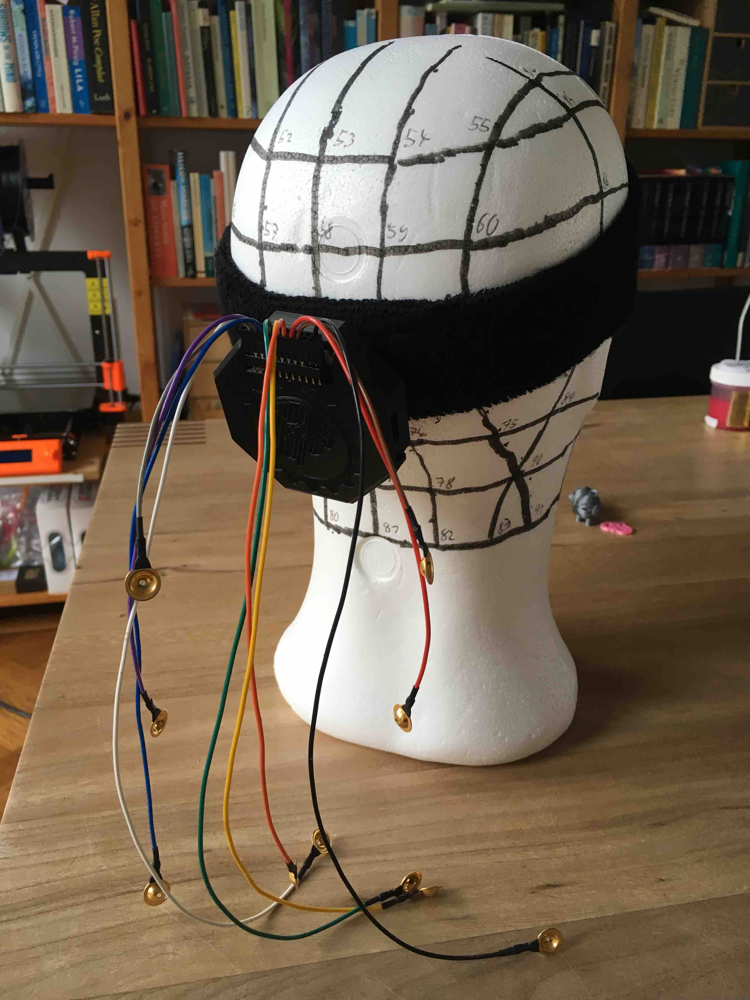
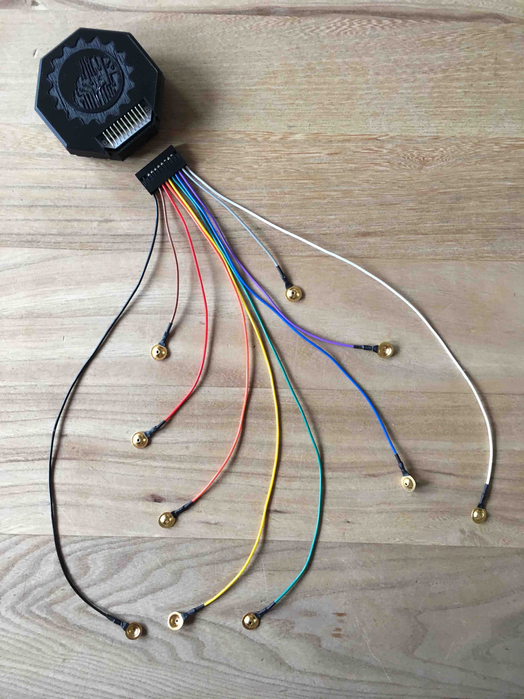

# EEG headband

The OpenBCI Ultracortex headset is a nice piece of hardware, but rather expensive (350-800 USD) and does not always provide a good fit with the subjects in terms of comfort and signal quality.

Using loose wires with cup electrodes offers flexibility and attaching a few of them with Ten20 paste to the scalp is not such a big deal. The advantage of cup electrodes combined with Ten20 paste is that signal quality is usually better and that a single set of 8+2 electrodes can be used to cover all head sizes.

Low-cost cup electrodes with Dupont connectors are available in the [OpenBCI shop](https://shop.openbci.com/collections/frontpage/products/openbci-gold-cup-electrodes), but also on [Ebay](https://www.ebay.com/itm/201515562354) where they usually come with DIN 42 802 "touch-proof" connectors. Better quality (i.e. thicker gold-plating and more flexible leads) sets are available from EEG vendors for about 100 USD for a set of 10 (e.g. here at [MedCaT](http://medcat.nl/supplies/EEGelec.htm)).

To facilitate the use of cup electrodes, we designed a head sweatband with the OpenBCI board attached to the back using Velcro. The electrode leads are cut to length and wired to a 11x2 Dupont connector. If you cannot find a 11x2 Dupont connector, you can take a longer one and cut it to length. After some sanding with fine sandpaper it will look just fine.

The OpenBCI board comes with a right-angle 11x2 male header soldered to it. SRB is on the left, followed by N1P-N8P, BIAS and AGND. The outer most pads on the PCB (AVSS on the left and AVDD on the right) are not connected to the header.

We have connected the 10 electrode leads to the SRB2 pin (the lower pin, i.e. closest to the PCB), P1-P8 (the upper pins) and one of the AGND pins, skipping the BIAS pin. This allows for a conventional common reference montage. The electrodes leads are cut to length to easily reach the following standard 10-20 electrode sites on the scalp:

- pin SRB2 - 31 cm - white  - left mastoid (M1) or alternatively AFz
- pin P1   - 11 cm - grey   - electrode site O1
- pin P2   - 18 cm - purple - electrode site P3
- pin P3   - 24 cm - blue   - electrode site C3
- pin P4   - 31 cm - green  - electrode site F3
- pin P5   - 31 cm - yellow - electrode site F4
- pin P6   - 24 cm - orange - electrode site C4
- pin P7   - 18 cm - red    - electrode site P4
- pin P8   - 11 cm - brown  - electrode site O2
- pin AGND - 31 cm - black  - right mastoid (M2) or alternatively Fpz

Note that SRB2 is on the side with the "P" pins and SRB1 is on the side with the "N" pins. Contrary to the two photo's included in this documentation, the white wire connected to SRB2 should be in one line with the colored wires connected to the "P" pins.

The leads are long enough so that they can reach one electrode site further to the front of the head. The longest ones (connected to the middle pins P4 and P5) can also reach around the head and be used for EOG.

PS Matt Millman has a very [interesting page](http://tech.mattmillman.com/info/crimpconnectors/#solder) with information about Dupont and other crimp terminals.
