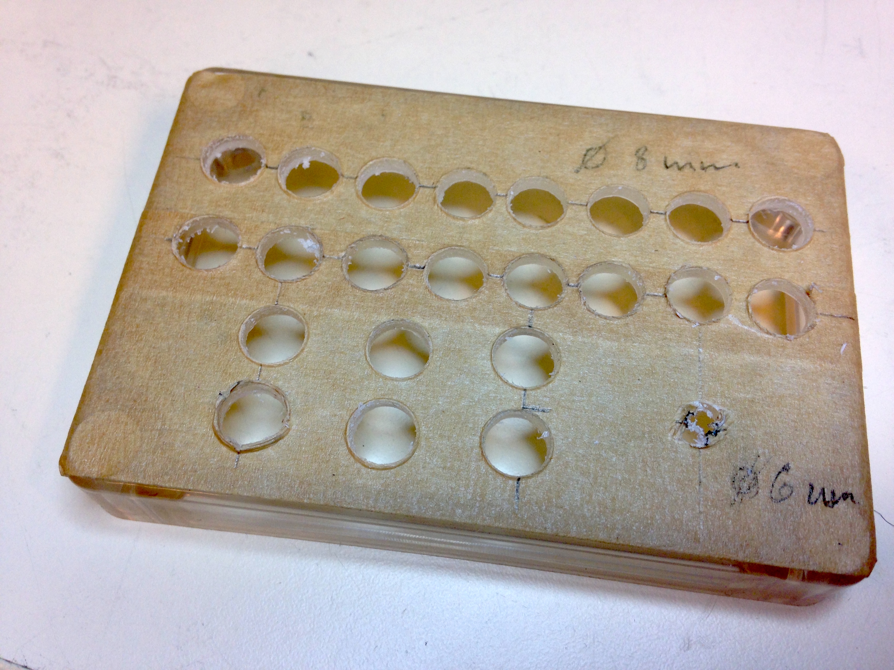
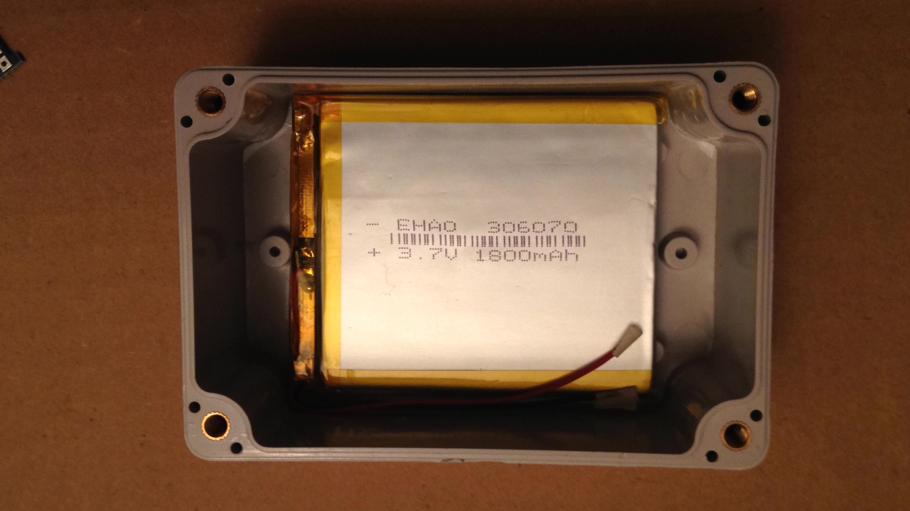
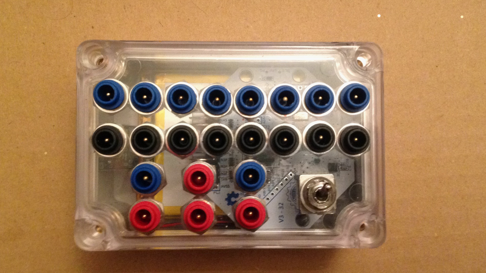

# OpenBCI Enclosure

This is a short description of an enclosure that we made for the 8-channel OpenBCI Cyton board. The specific purpose was to expose all pins of the 11x2 header using DIN 42 802 "touch-proof"  connectors.

The box is an 100x68x50 mm clear cover project enclosure from [Ebay](https://www.ebay.com/itm/Waterproof-Clear-Cover-Plastic-Electronic-Project-Box-Enclosure-CASE-100x68x50mm). Furthermore, it contains DIN 42 802 "touch-proof" panel mount jacks from [Medcat](http://medcat.nl/supplies/adapters.htm), a 3-position (on-off-on) toggle switch, a Lipo battery and a Micro-USB Lipo charging module from [Ebay](https://www.ebay.com/itm/5V-Micro-USB-1A-18650-Lithium-Battery-Mini-Charging-Board-Lipo-Charger-Module).  The toggle switch is connected to allow switching between off, on, and charge. This ensures that the OpenBCI board is never directly connected or powered by the charger, but only by the battery

