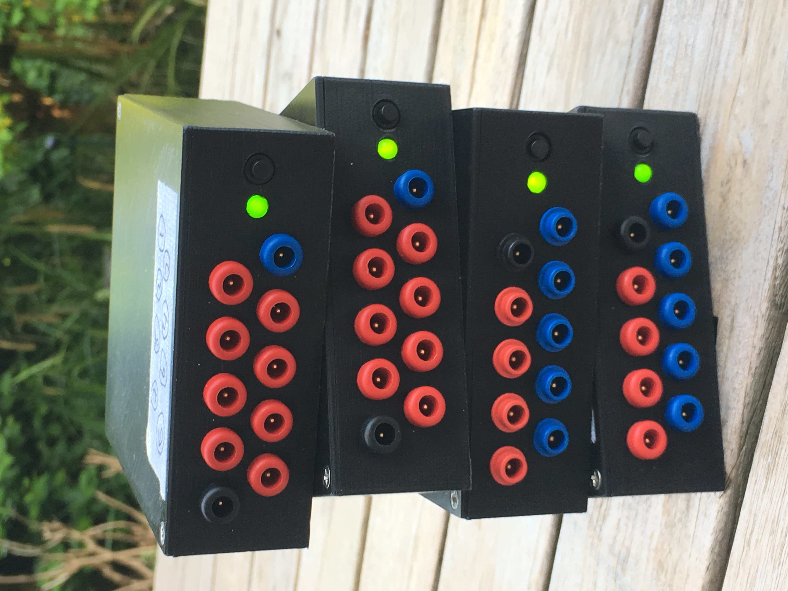

# OpenBCI Enclosure version 2

We designed and 3-D printed a number of enclosures that can be used both with the OpenBCI Cyton and Ganglion boards, optionally with a WiFi shield). The enclosure exposes 10 pins of the board (GND, REF and 8 channels) through [DIN 42 802 adapters](https://www.medcat.nl/supplies/En/adapters.htm) and includes a 850mAh LiPi battery and charger.

For the Cyton boards we used one black (GND), one blue (SRB1, i.e. REF) and 8 red connectors.

For the Ganglion boards we used one black (GND), one blue (common REF), 4 red (plus pin) and 4 blue (minus pin) connectors.

More details can be found [here](https://robertoostenveld.nl/touch-proof-enclosure-for-openbci/).
