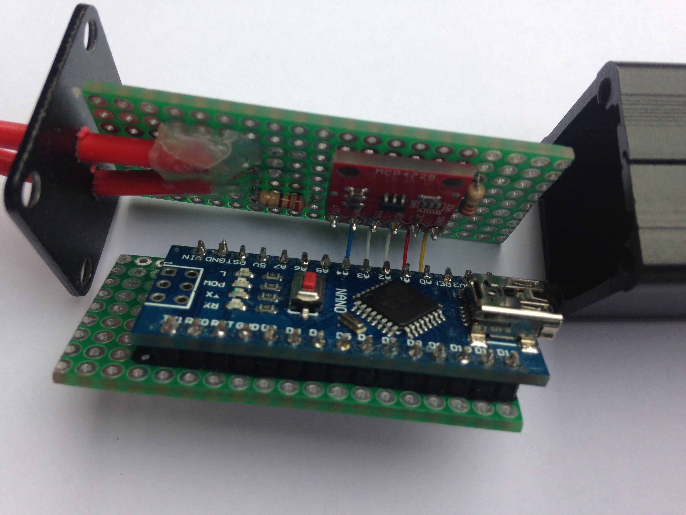

# USB to CV/Gate

This is a one-channel version of a CV/Gate controller. It comprises of an Arduino Nano combined with a single 12-bit DAC module. The output control voltage is between 0 and 5 V, or slightly less. The maximum output voltage depends on the output of your USB port and of the voltage controller in the Arduino Nano. It also exposes one of the digital output pins of the Arduino as an analog gate.

This hardware works well with the [outputcvgate](../../module/outputcvgate)  module.

The Arduino code for the firmware of this device can be found on [github](https://github.com/robertoostenveld/arduino/tree/master/eegsynth_cvgate_mcp4725).

## Alternatives

Alternatives for this are for example the [Endorphin.es Shuttle control](https://www.endorphin.es) (for which we have a corresponding EEGsynth [module](../../module/endorphines/)), the [CV.OCD](https://www.tindie.com/products/hotchk155/cvocd-a-super-flexible-midi-to-cv-box/), the [Doepfer A-190](http://www.doepfer.de/a190.htm) or one of these modules on [Modular Grid](https://www.modulargrid.net/e/tags/view/10). Most of them are expected to work with the [outputmidi](../../module/outputmidi/) module.

We have also constructed a [4-channel](../usb2cvgate_4channel/) version of this that has an output range from 0 to +10 Volt and that includes more gates.

You could also use a bridge rectifier based on 4 diodes to rectify the a high-frequency sine wave audio output from your computer. If you pass the rectified audio through a low-pass filter, you will have a control voltage that you can control with the audio volume or the amplitude of the sine wave.    
