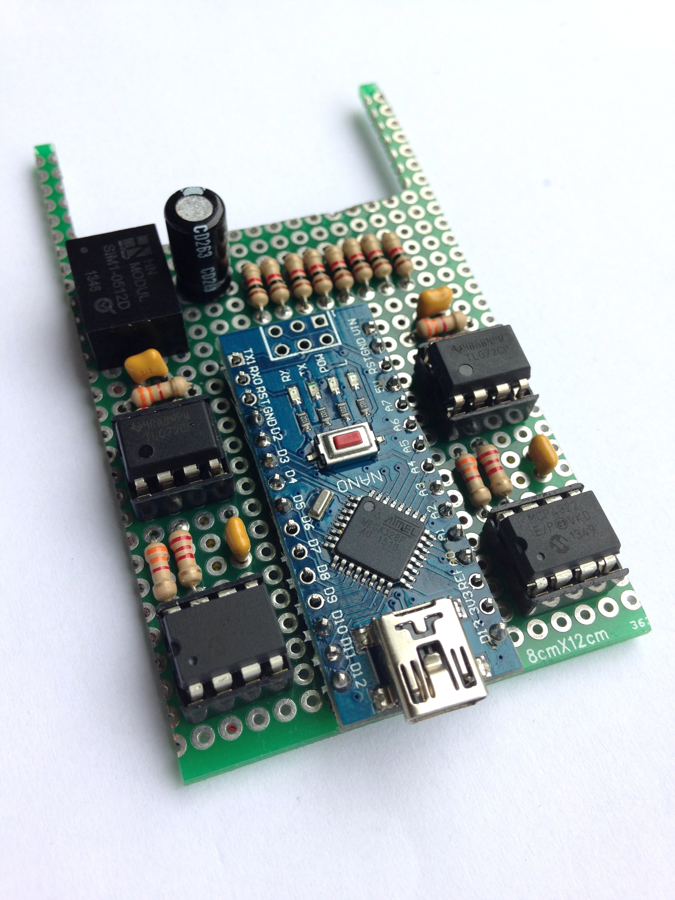

# USB to CV/Gate

This is a 4-channel CV/Gate controller. It comprises of an Arduino Nano combined with 12-bit DACs and some operational amplifiers. The output voltage range is from 0 to 10V. It also exposes 4 digital output pins of the Arduino as an analog gates.

This hardware works well with the [outputcvgate](../../module/outputcvgate)  module.

The Arduino code for the firmware of this device can be found on [github](https://github.com/robertoostenveld/arduino/tree/master/eegsynth_cvgate_mcp4822).

## Alternatives

Alternatives for this are for example the [Endorphin.es Shuttle control](https://www.endorphin.es) (for which we have a corresponding EEGsynth [module](../../module/endorphines)), the [CV.OCD](https://www.tindie.com/products/hotchk155/cvocd-a-super-flexible-midi-to-cv-box/), the [Doepfer A-190](http://www.doepfer.de/a190.htm) or one of these modules on [Modular Grid](https://www.modulargrid.net/e/tags/view/10). Most of them are expected to work with the [outputmidi](../../module/outputmidi) module.

We have also constructed a simpler [1-channel](../usb2cvgate_1channel/) version of this with an output range from 0 to (approximately) 5V.
