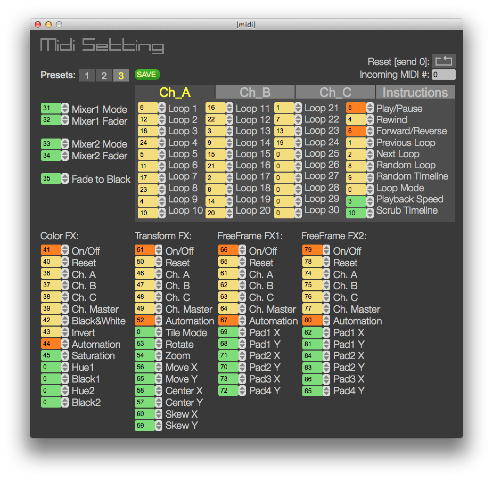

# AVmixer Module

The purpose of this module is to provide an interface to the [AVmixer software](https://neuromixer.com/products/avmixer).

AVmixer incorporates a MIDI interface which can pick up software MIDI messages from other software running on the same computer. The MIDI settings pannel allows the mapping of the incoming MIDI messages onto software functions. It allows three presets for different MIDI interfaces.  

AVmixer can also be controlled using the TouchOSC app, which sends OSC messages that are translated by the [TouchOSC MIDI bridge](http://hexler.net/docs/touchosc-configuration-connections-bridge) into software MIDI commands. AVmixer includes a TouchOSC template layout that is configured to work out of the box with the factory configured presets "3".

You can control the AVmixer software both (and simultaneously) from this EEGsynth module and from the TouchOSC interface.

## MIDI presets

The previous version of AVmixer came with a preset that was suited for the TouchOSC app. The latest version (2.7.1) does not come with any presets. Editing the settings can be done in the MIDI settings" graphical user interface or in the file

    /Applications/AVmixer Lite 2.71.app/Contents/Resources/midiconfig_pro.json

## Requirements

AVmixer (pro or lite) software from https://neuromixer.com.

The MIDI configuration/preset should be properly configured.

CoreMIDI or rtpMIDI support, in case you want to control the AVmixer software on computer A while the EEGsynth module is running on computer B.

## Software Requirements

Python 2.x
portmidi
mido
