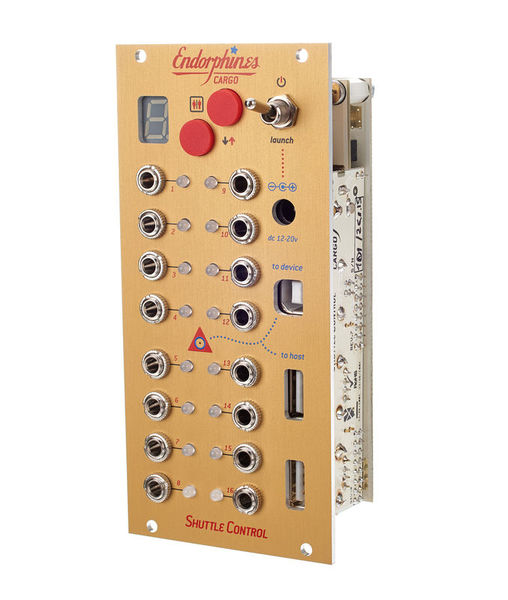

# Endorphines Module

The purpose of this module is to send control values from Redis to the Endorphin.es Shuttle Control. The Shuttle Control is a MIDI to CV/Gate converter with 16 channels that can be controlled from -5 to +5 Volt.

## Alternatives

Alternatives to this module are the DIY [1-channel](https://github.com/eegsynth/eegsynth/tree/master/hardware/usb2cvgate_1channel) and [4-channel](https://github.com/eegsynth/eegsynth/tree/master/hardware/usb2cvgate_4channel) USB-to-CV/gate converters that we made for EEGsynth and that are supported by the *outputcvgate* module. Other alternatives that are not yet supported with EEGsynth are fo example the Expert Sleepers [ES3](http://www.expert-sleepers.co.uk/es3.html), the Doepfer [A-190-1](http://www.doepfer.de/a190.htm), [A-190-2](http://www.doepfer.de/a1902.htm) and [MCV4](http://www.doepfer.de/mcv4.htm), and the Kenton [Modular-SOLO](http://www.kentonuk.com/products/items/m-cv/modsolo.shtml) and [Pro-SOLO](http://www.kentonuk.com/products/items/m-cv/prosolo.shtml).
