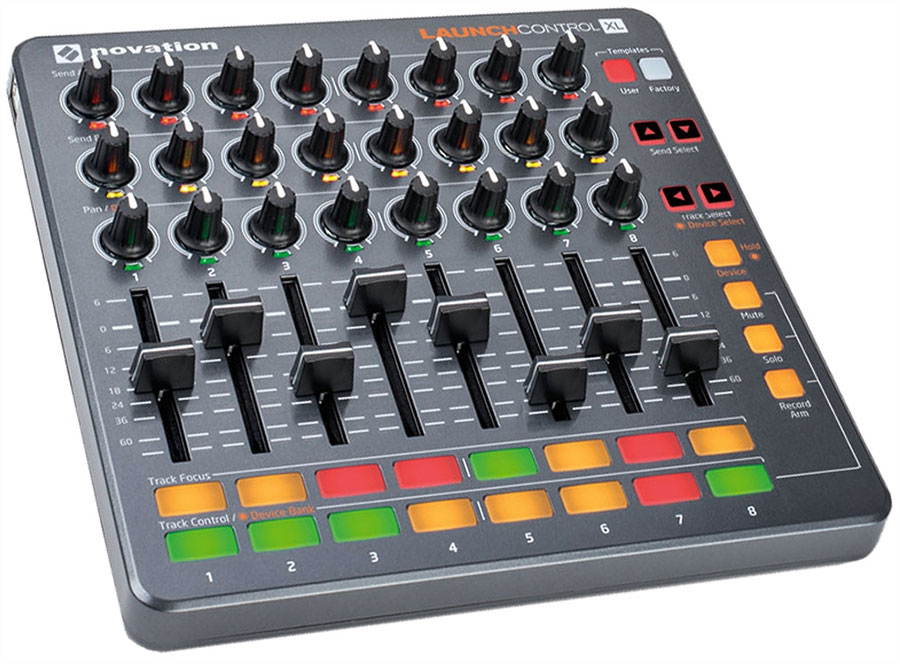
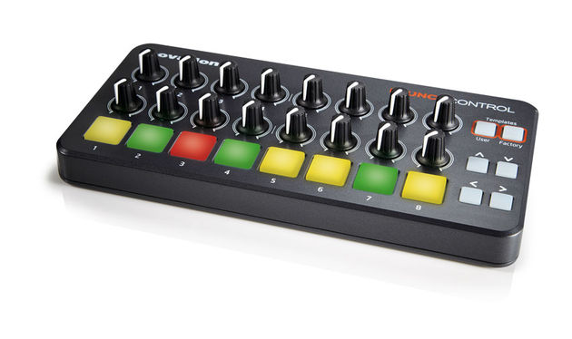

# Launch Control Module

The purpose of this module is to process input MIDI commands from a Novation LaunchControl or LaunchControlXL digital control surface. The values of the sliders and knobs are sent as control signals to the Redis buffer. The button press and release events are sent as triggers to the Redis buffer.

For the buttons you can specify whether they should respond as push buttons (on/off) or as toggle buttons.

Push buttons are momentary, i.e. only "on" while you keep your them depressed. Toggle buttons retain their state after you release them, pressing once more switches to the next state. The following options are supported, which are also represented using the color code of the LED:

  * toggle1 buttons switch between on-off
  * toggle2 buttons switch between on1-on2-off
  * toggle3 buttons switch between on1-on2-on3-off
  * toggle4 buttons switch between on1-on2-on3-on4-off



We are primarily developing with the XL version, but the code is confirmed to also with the smaller (non-XL) version.



## MIDI assignment

The LaunchControlXL has three rows of 8 rotary dials each, 8 sliders, two rows with 8 buttons, and some buttons on the right side. Here I will sketch the outline of the main control elements with the *default* MIDI codes. The MIDI codes can be reassigned with the Novation LaunchControlXL Editor application.

```
(13) (14) (15) (16) (17) (18) (19) (20)
(29) (30) (31) (32) (33) (34) (35) (36)
(49) (50) (51) (52) (53) (54) (55) (56)
  -    -    -    -    -    -    -    -
  |    |    |    |    |    |    |    |
 77   78   79   80   81   82   83   84
  |    |    |    |    |    |    |    |
  -    -    -    -    -    -    -    -
[41] [42] [43] [44] [57] [58] [59] [60]
[73] [74] [75] [76] [89] [90] [91] [92]
```

The LaunchControl has two rows of 8 rotary dials each, one row with 8 buttons, and some buttons on the right side. Here I will sketch the outline of the main control elements with the *default* MIDI codes. The MIDI codes can be reassigned with the Novation LaunchControl Editor application.

```
(21) (22) (23) (24) (25) (26) (27) (28)
(41) (42) (43) (44) (45) (46) (47) (48)
[ 9] [10] [11] [12] [25] [26] [27] [28]
```

## Known issues

If you get the error
```
AttributeError: 'module' object has no attribute 'API_UNSPECIFIED'
```
and you have installed both mido and midirt, then you should try
```
export MIDO_BACKEND=mido.backends.rtmidi_python
```
