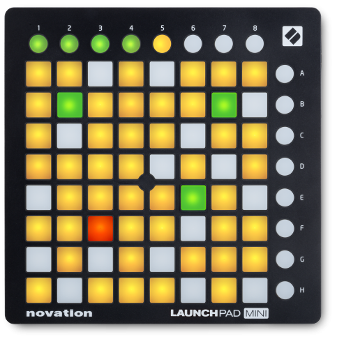
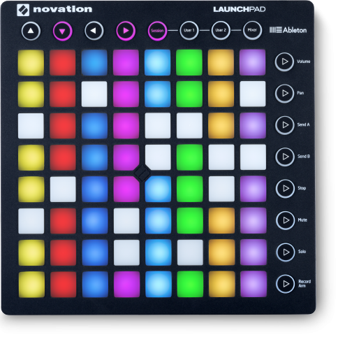

# Launchpad Module

The purpose of this module is to process input MIDI commands from a Novation Launchpad digital control surface. The button press and release events are sent as triggers to the Redis buffer.

For the buttons you can specify whether they should respond as push buttons (on/off) or as toggle buttons.

Push buttons are momentary, i.e. only "on" while you keep your them depressed. Toggle buttons retain their state after you release them, pressing once more switches to the next state. The following options are supported, which are also represented using the color code of the LED:

  * toggle1 buttons switch between on-off
  * toggle2 buttons switch between on1-on2-off
  * toggle3 buttons switch between on1-on2-on3-off
  * toggle4 buttons switch between on1-on2-on3-on4-off



We are developing for the Mini version, but expect that the same code will also work with the larger MK2 version.



## MIDI assignment

The Launchpad has 8 rows with 8 buttons each, eight buttons (1-8) at the top, and eight buttons (A-H) on the right side. Here I will sketch the outline of the main control elements with the *default* MIDI codes. The MIDI codes can be probably be reassigned with a Novation Editor application (not confirmed).

```
(104) (105) (106) (107) (108) (109) (110) (111)

[000] [001] [002] [003] [004] [005] [006] [007]    (008)
[016] [017] [018] [019] [020] [021] [022] [023]    (024)
[032] [033] [034] [035] [036] [037] [038] [039]    (040)
[048] [049] [050] [051] [052] [053] [054] [055]    (056)
[064] [065] [066] [067] [068] [069] [070] [071]    (072)
[080] [081] [082] [083] [084] [085] [086] [087]    (088)
[096] [097] [098] [099] [100] [101] [102] [103]    (104)
[112] [113] [114] [115] [116] [117] [118] [119]    (120)
```
