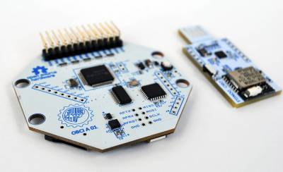

# OpenBCI module

This module reads data from the OpenBCI Cyton board (over the USB dongle) and writes this data to the FieldTrip buffer. At the start of data acquisition the FieldTrip buffer will be reset.

Prior to starting this module the FieldTrip buffer should be running, the RF dongle should be plugged and the board should be switched on.

Furthermore, you should have write permissions to the device. If *getattr error* is shown this is likely not the case. In that case one can run the openbci2ft module in sudo mode.

## Confusion between SRB1 and SRB2

**Warning: in the [schematics](https://raw.githubusercontent.com/OpenBCI/Docs/master/assets/images/OBCI_V3_32bit-Schematic.jpg) of the OpenBCI cyton board the SRB1 and SBB2 labels are swapped; in the TI [ADS1299 datasheet](http://www.ti.com/lit/ds/symlink/ads1299.pdf) you can see that SRB1 is pin 17 on the corner, and hence following the [PCB layout](https://raw.githubusercontent.com/OpenBCI/Docs/master/assets/images/OBCI_32bit_layerTop.jpg) connected to the top pin of the double cyton header.**
