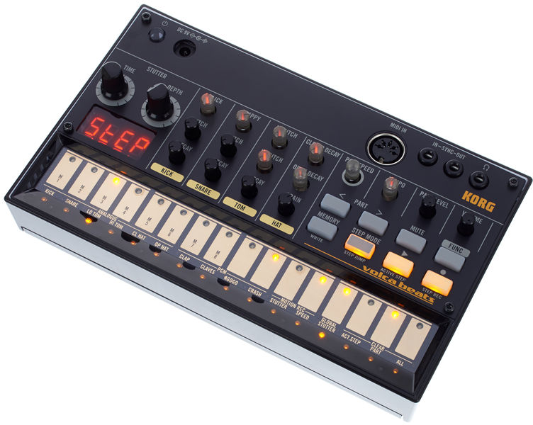

# Volca Beats Module

The purpose of this module is to write control values and notes as MIDI commands to the Korg Volca Beats.

Setting the MIDI channel: While holding down the MEMORY button, turn on the Volca. Specify the channel and press the REC button.

## MIDI note mapping

The beats have the following MIDI codes

kick       = 36
snare      = 38
lo_tom     = 43
hi_tom     = 50
closed_hat = 42
open_hat   = 46
clap       = 39

Besides the MIDI codes for the beats, there are also MIDI codes for the controls.
