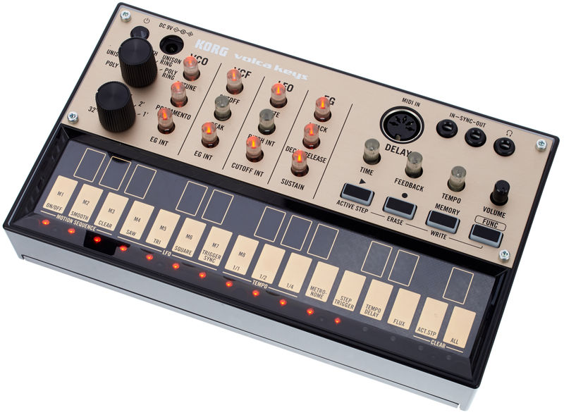

# Volca Keys Module

The purpose of this module is to write control values and notes as MIDI commands to the Korg Volca Keys.

Setting the MIDI channel: While holding down the MEMORY button, turn on the Volca. Specify the channel and press the REC button.

