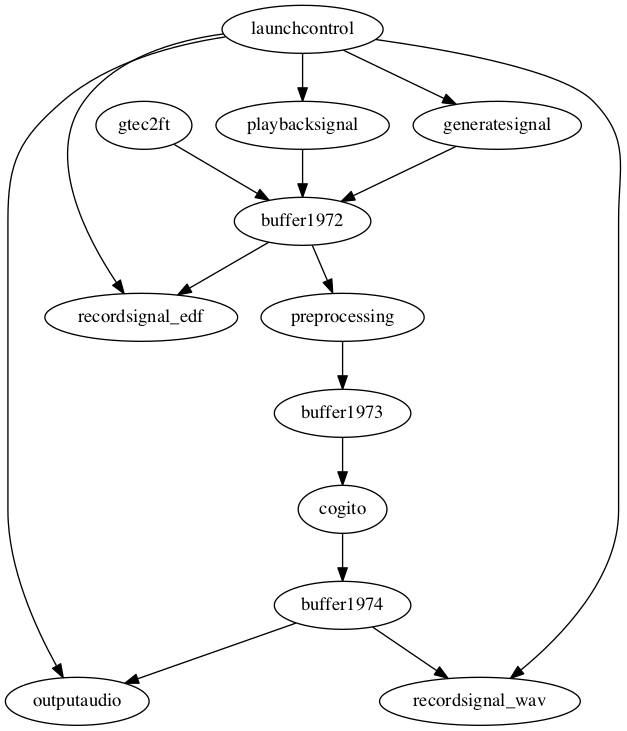

# Cogito

This is the patch for the Cogito presentation at [acces-s cultures electroniques](https://acces-s.org) in Pau (France) on 10 October 2019. The EEGsynth is configured to run on a Raspberry Pi with an HiFiBerry audio "hat" and with a LaunchControl mini. Furthermore, a Windows laptop is used for the EEG measurement and streaming the raw data to the Raspberry Pi.

## LaunchControl mini

The LaunchControl mini has two rows with 8 rotary dials each, and one row with 8 buttons. These are the MIDI codes:

```
(21) (22) (23) (24) (25) (26) (27) (28)
(41) (42) (43) (44) (45) (46) (47) (48)
[ 9] [10] [11] [12] [25] [26] [27] [28]
```

## Schematic representation of the patch


