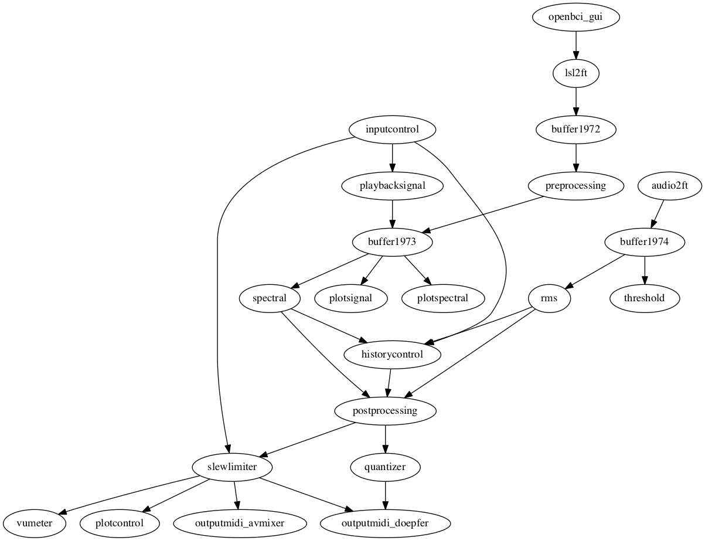

# Andouillette patch - macOS

The main feature of this patch is that it provides the alpha power
of the two occipital electrodes as two CVs througfh the Doepver
A-190-3. Furthermore, the alpha power of one channel is used to
control the video mix through AVmixer, whereas the beta power of
the same channel is used to control the speed of the video.

## Schematic representation of the patch

