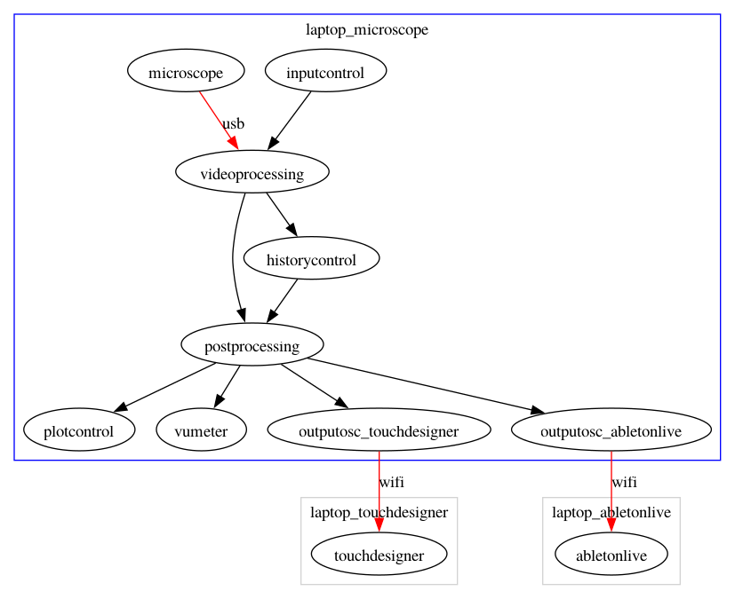

# BodyMind, Copenhagen 2025

This is the EEGsynth patch for the performance that is part of the BodyMind workshop at [Q-Space in Copenhagen](https://kunstakademiet.dk/en/activities-news/exhibition-space-q), taking place from 24 to 26 Februari 2025.

## Overall setup

We are using a Euromex BioBlue.lab microscope with a Eakins 5.0 MP USB camera to observe the microbes. The live video stream is processed using the EEGsynth and changes in the video (due to the microbes moving around) are sent over OSC as control signals to TouchDesigner (running on another laptop) and Ableton Live (running on yet another computer).

Since we are using three separate TouchDesign patches or sets, there are three `outputosc` processes running that output it to three different UDP ports corresponding to the three TouchDesign sets.

The live video stream from the microscope is also shared as-is with TouchDesigner on the other computer for video-mixing and creating visuals. To share the video, we are using NDI Scan Converter to capture the videoprocessing window. The NDI stream is subsequently displayed on a second "virtual" screen using NDI Video Monitor. The second screen is actually a MZ0404 HDMI splitter which connects to an HDMI-to-USB capture card that goes into the computer running Touchdesigner. On the TouchDesigner computer we capture the video as if it is a webcam, and crop it ia little bit remove the menu bar and the window borders.

## EEGsynth screenshot

The screenshot below shows the EEGsynth graphical user interface with the videoprocessing, inputcontrol, vumeter, and plotcontrol modules. Not visible are the historycontrol, postprocessing, and outputosc modules.

