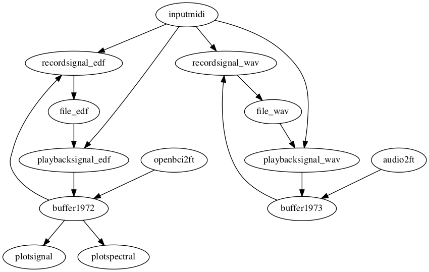

# Carol Trio patch

"Musical improvisation is one of the first ways that human beings have found to
express themselves through sound. It is also one of the few collective and
instantaneous art forms. However, the mental states and neural bases of
improvisation remain poorly understood today. During this event, repeated twice,
we propose to question ourselves on the nature of such states. Each performance
will begin with an improvisation by the Carol Trio (Christophe Rocher, Frédéric
B. Briet and Nicolas Pointard) during which the brain activity of one of the
three improvisers will be recorded, as well as the sound. The researchers will
then proceed to a re-listening phase of the performance, during which the
improvisers will try to characterize and comment on the instant subjective
experience of the performance. Finally, the public will be invited to discuss
with musicians and scientists the musical, cognitive, sonic and neuroscientific
aspects involved in the experiment. This experience will be broadcast live on
Facebook.

This piece will be performed by Nicolas Farrugia and the Carol Trio on 16 March
2019 in Brest, France. See [this website](https://dev.semaineducerveau.fr/manifestation/cerveau-et-improvisation-musicale%E2%80%89-un-concert-exploratoire/) for further details.

## Starting all modules

The list of modules for the recording part of the performance is

-  redis.sh
-  buffer.sh
-  inputmidi.sh
-  openbci2ft.sh
-  audio2ft.sh
-  preprocessing.sh
-  plotsignal.sh
-  plotspectral.sh
-  plottrigger.sh
-  recordsignal_eeg.sh
-  recordsignal_sound.sh
-  recordcontrol.sh
-  recordtrigger.sh

The list of modules for the playback part of the performance is

-  redis.sh
-  buffer.sh
-  inputmidi.sh
-  playbacksignal_eeg.sh
-  playbacksignal_sound.sh
-  plotsignal.sh
-  plotspectral.sh
-  outputaudio.sh

Some of the modules are the same between the recording and playback part, you
should be able to keep these running.

The recordsignal and the playbacksignal modules will respond to a midi note to
enable playing, to pause and to rewind. An alternative to the inputmidi is to
use redis-cli, see below.

You may have the Redis server already running in the background.

## Enable/disable recording and playback

Since the inputmidi module does not support the latching of buttons like the
launchcontrol module (i.e. a button switches to on when pressed once, and
switches to off when pressed a sedonc time), and since I do not want to keep the
button pressed all the time, I will use redis-cli instead to write the control
values directly to the Redis buffer.

The actual midi notes correspond to the row of buttons on the small Launch
Control device.

    redis-cli set midi.note009 1  # for record on
    redis-cli set midi.note009 0  # for record off
    redis-cli set midi.note010 1  # for playback on
    redis-cli set midi.note010 0  # for playback off
    redis-cli set midi.note011 1  # for playback pause on
    redis-cli set midi.note011 0  # for playback pause off
    redis-cli set midi.note012 1  # for playback rewind on
    redis-cli set midi.note012 0  # for playback rewind off

## Schematic representation of the patch

