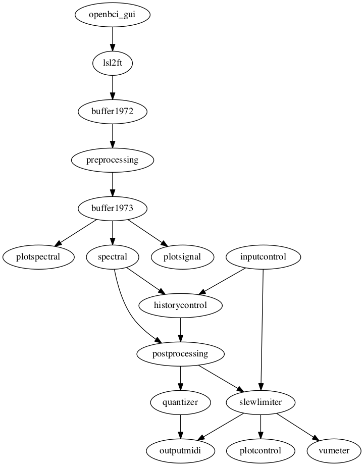

# Copenhagen recording session

_This patch was implemented for the March 2020 recording session at Huhta home studio
in Copenhagen. Due to the corona pandemic, the recording session had to be canceled.
We expect to use this patch for a future session._

This patch provides the alpha power of the two occipital electrodes as two control
voltages on the Doepfer A-190-3 module.

## Schematic representation of the patch



## Instructions for starting the patch

```
Connect electrodes to participant
Connect electrode leads to amplifier
Start amplifier

Start OpenBCI GUI

Data source -> Select live from Ganglion
Bluetooth (built in)
Search for devices
Select Ganglion-xxx
Back in left-most column -> START SYSTEM
In the left panel of the OpenBCI GUI, make sure that "Timeseries" is selected
In the upper left corner -> start data stream
(you should now see some signals flowing on the screen)
In the right panel of the OpenBCI GUI, make sure that the "Networking" panel is selected
Select protocol = LSL
Set 1st stream to TimeSeries
Start (this starts the LSL stream)

Open terminal

cd eegsynth/patches/copenhagen
./redis.sh

Open 2nd tab in terminal (e.g. using Command-T)
./buffer.sh

Open 3rd tab in terminal
eegsynth *.ini
```
