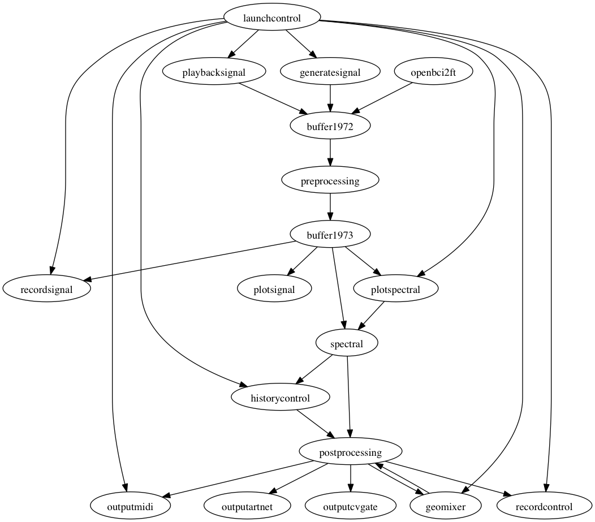

# Gothenburg patch

This directory contains the patches for the February 2019 performance at the folkTheatern in Gothenburg.

The EEG goes into the spectral module and then into the `historycontrol` module to construct a well-behaved and slowly changing control signal. Using the `outputcvgate` module, that control signal is converted into a voltage that goes into the analog synthesizer.

Furthermore, there are three videos (A, B and C) that fade into each other. The mix is controlled by a single brain control signal, which goes through the `geomixer` module to map it onto three channels for each A, B and C. The AVmixer software has "mixer 1" that controls the balance between A and B, and "mixer 2" that controls the balance between the A+B and the C mix. The `postprocessing` module is used to map the three channels from the `geomixer` onto the two hierarchical mixer channels, which are transmitted by `outputmidi` to the AVmixer software.

## Schematic representation of the patch

The following visualizes the relation between the modules. The `redis` module is not displayed explicitly, but is omnipresent since most communication between modules goes over Redis.



## MIDI

We use Apple coreMIDI to set up a shared MIDI network sesssion between the main EEGsynth computer and the computer running the AVmixer software. This allows the `outputmidi` module to run on the main EEGsynth computer and MIDI commands to be transparently send to the computer running AVMixer.

## Redis/cvgate

Lacking a sufficiently long USB cable, we started the `outputcvgate` module on another computer positioned close to the analog synthesizer. To allow client connections from that computer, it was needed to start `redis-cli` on the main EEGsynth computer and execute `config set protected-mode off`.

## Launchcontrol

We are using the Novation Launchcontrol XL and the `launchcontrol` module to start/pause/restart certain features and to make live parameter adjustments. Below is a schematic representation of the MIDI controls and notes.

```
(13) (14) (15) (16) (17) (18) (19) (20)
(29) (30) (31) (32) (33) (34) (35) (36)
(49) (50) (51) (52) (53) (54) (55) (56)
  -    -    -    -    -    -    -    -
  |    |    |    |    |    |    |    |
 77   78   79   80   81   82   83   84
  |    |    |    |    |    |    |    |
  -    -    -    -    -    -    -    -
[41] [42] [43] [44] [57] [58] [59] [60]
[73] [74] [75] [76] [89] [90] [91] [92]
```
