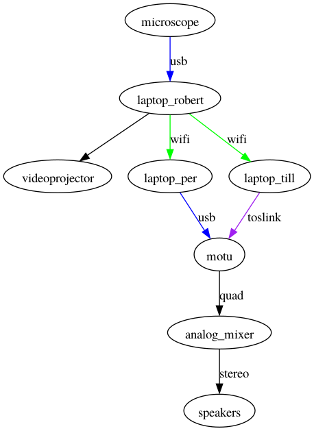
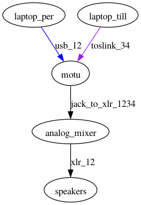

# Ghent University Museum - GUM

This is the patch for the microbe performance at GUM on 7 June 2023. It involves a microscope, three laptops (from Robert, Per and Till), a MOTU audio interface, an analog audio mixer and a pair of speakers

The overall hardware connection diagram is like this

 
The EEGsynth is running with some modules on Robert's laptop and is used to convert the microscope image in real-time to control signals, which are sent as OSC over wifi. This laptop is also connected to a projector, allowing the participants to see the (filtered) microscope images and control signals.

The MOTU audio interface is connected both to Per's laptop and to Till's laptop.

 
