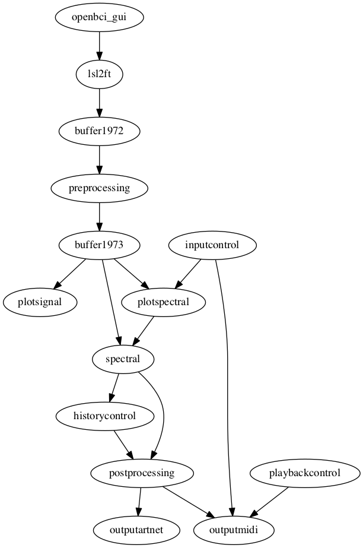

# Karlstad patch

This patch is for the performance by Per Huttner and Jean-Louis Huhta at
Galleri Ekdahl in Karlstad on Saturday 25 May, 2019.

- <https://www.galleriekdahl.se>

## Modules

You should start by connecting the electrodes to the performer and
the amplifier, and starting the OpenBCI GUI application with the
proper settings. Subsequently you can start the EEG data stream and
start the LSL stream.

The EEGsynth modules should then be started in the following order:

1. redis.sh
2. buffer.sh
3. lsl2ft.sh
4. preprocessing.sh
5. inputcontrol.sh
6. plotsignal.sh
7. plotspectral.sh
8. spectral.sh
9. historycontrol.sh
10. postprocessing.sh
11. quantizer.sh
12. playbackcontrol
13. outputmidi.sh
14. outputartnet.sh
15. recordcontrol.sh

## Schematic representation of the patch

