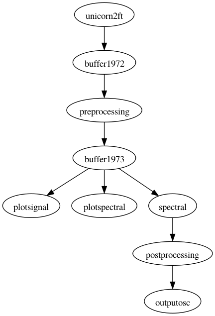

# Gothenburg patch

This directory contains the patches for the demonstration at the Tekniska Museum in Stockhom as part of the Östersjöfestivalen on 2 September 2023.

## Schematic representation of the patch

The following visualizes the relation between the modules. The `redis` module is not displayed explicitly, but is omnipresent since most communication between modules goes over Redis.

The OSC is sent to another computer that runs the mapping program from Ludvig (implemented in SuperCollider) which scales the EEGsynth output and sends it as MIDI to Ableton, also running on that computer.

