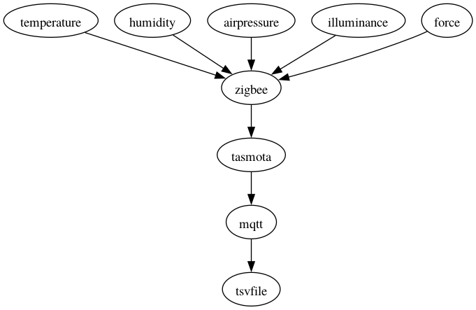

# Outpost

This patch is for an artistic development during 2026 at the [Outpost](https://www.facebook.com/groups/1077903107624607/) in Riddahyttan, formerly known as the Theatermachinen. See [here](https://maps.app.goo.gl/miLyH52Jqa8LLQy28) on the map.

This patch currently does not use any of the regular EEGsynth modules, but consists of its own Python script receives information from various sensors connected over Zigbee to a [Tasmota](https://tasmota.github.io/docs/Zigbee) gateway that sends the data to an MQTT server.

## Schematic representation of the patch

