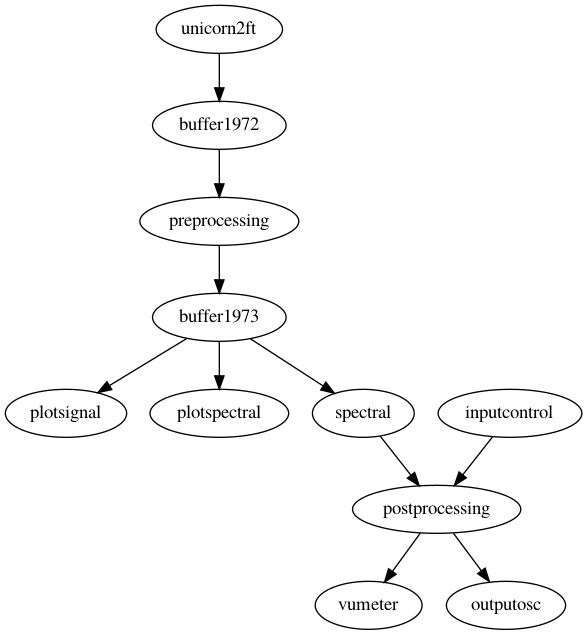

# Per two

This is the 2nd generation (or possibly the 3rd or 4th generation)
general purpose patch for Per. It allows using the unicorn EEG headset
with spectral estimates for the canonical frequency bands that are sent
over OSC as log-transformed power.

Looking at the top of the head with the nose pointing up, this is how
the channels are numbered:

         ---^---
       /    1    \
     L|  2  3  4  |R
      |     5     |
       \ 6  7  8 /
         -------

**DO not foget to attach the stickers behind the left and right ear.**

This patch does not include any normalization, but calibration values
are set so that it probably will work most of the time.

If you encounter Bluetooth connection problems on macOS, such as the
LED keeps giving short flashes which indicates that it is not connecting,
open a terminal and type

    sudo pkill bluetoothd

## Schematic representation of the patch

