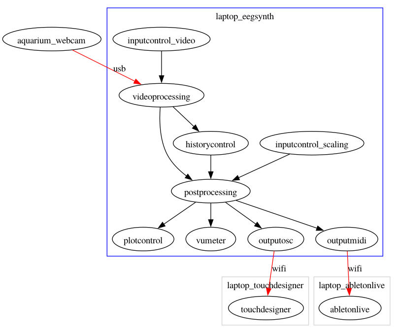

# Gothenburg

This is the patch for the performance at the Gothenburg Science Festival on 18 April 2024 at the [Sjovarts Museet Akvariet](https://www.sjofartsmuseetakvariet.se/en/) (Maritime Museum and Aquarium).

## Overall setup

The overall patch looks like this

A GoPro is pointing down, floating in a glass-bottom bucket in the aquarium with the cod. The live video stream from the GoPro is processed using the EEGsynth and changes in the video (due to the fish moving around) are sent over OSC as control signals to TouchDesigner (running on another laptop) and Ableton Live (running on yet another computer).

The live video stream from the GoPro is also shared with TouchDesigner through an HDMI splitter and a HDMI-to-USB capture card. TouchDesigner is used for video-mixing and creating visuals.
