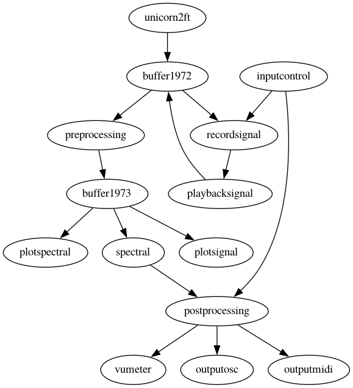

# Tekniska Museet

This directory contains the patch that we designed for the event from 10-12 February 2023 at the [Tekniska Museet](https://www.tekniskamuseet.se/en/) in Stockholm. During that event an interdiciplinary team of artists, neuroscientist and marine biologists will colaborate on and demonstrate to the public combined human EEG and hydrophone recordings from the sounds that coastal cod (i.e., the fish) use as mating calls. The combination of real-time introspective brain states, the pattern of movements and the sounds of cod to communicate under water, combined with musical instruments such as the upright bass, result in a spatiotemporal soundscape that explores the relation and our perception of an important and unique species that suffers from overfishing and "ghost fishing".

## Technical outline

This EEGsynth patch starts with the signals from an 8-channel [Unicorn](https://www.unicorn-bi.com) EEG system. The electroencephalographic brain activity comprises different frequency bands (delta, theta, alpha, beta, gamma) that are processed and converted into continuous control channels. These are shared over OSC and MIDI with Ableton Live to trigger and control sounds and music.

## Schematic representation of the patch

