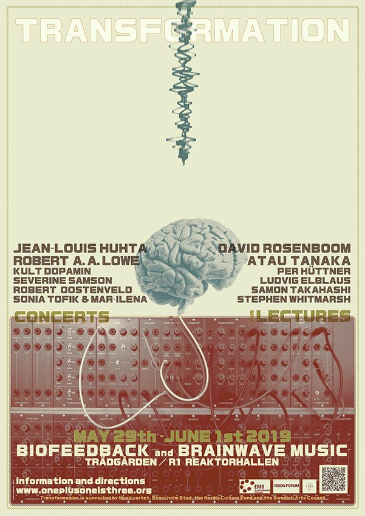

# Transformation - Concerts and lectures on mind-body-music transformations

Transformation centers on transformations between music - body,  brain - body, sound - music, triggers - events, matter - energy, digital - analogue. The events will move between underground experiences in R1 and sunny meetings at Trädgården, featuring seminal figures in experimental music, neuroscience and performance-art in cross-disciplinary dialogues and multimedia performances.

Transformation is a multi-day event in which multiple patches have be used for experimentation and performances.

# Where and when

Thursday 29/05/2019 to Sunday 02/06/2019

Performances, lectures and demonstrations were at R1 and Trädgården.

# Patches for the EEGsynth performances

## Bartender

Both on Thursday and Saturday evening at R1, the bartender (Per) was using his heartbeat to light up the bar and his heart rate to determine the price of drinks.

## Tradgarden

On Friday evening Per, Jean-Louis and Robert performed in the Red Room at Trädgården.

## R1

On Saturday evening Samon and Stephen performed in R1.

## Jam

On Saturday later in the evening we did a jam with three brain-controlled instruments and one muscle controlled instrument. The patch for Stephen and Samon was the same as earlier that evening; the patch for Per, Jean-Louis and Robert was different than the previous one and is documented here.
