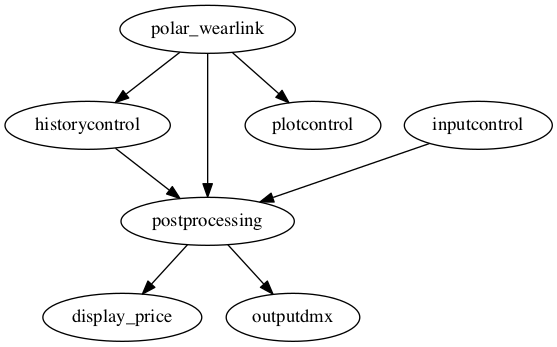

# Bartender

This patch uses the Polar T34 chest strap with the Wearlink interfaced to a Wemos D1 mini. It detects each beat and the heart rate. The beats are used to control over DMX the light behind the bar. The minimum and maximum level are specified in the `inputcontrol` graphical interface, as well ass the color (R, G and B). The heart beats are also displayed using `plotcontrol`.

Furthermore, it maps the heart rate as a continuous variable to a scale between 0 and 1, which is subsequently used to dynamically adjust the price of the drinks with the excitement (heart rate) of the bartender. The price is displayed in a separate terminal using the small `display_price` script, which uses watch and redis-cli.

## Schematic representation of the patch

