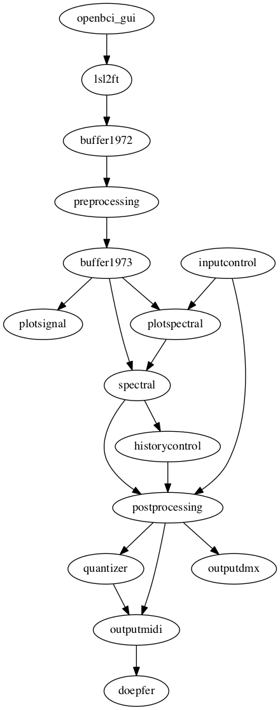

# Tradgarden

This patch uses the EEG recorded from two electrodes on the back of the head. The patch extracts the alpha amplitude envelope and uses that to control multiple outputs:

1. Control voltage from Doepfer A190-3 for modular synthesizer (using `outputmidi`)
1. Programmable LED bar that illuminates the wall (using `outputdmx`)

## Schematic representation of the patch

