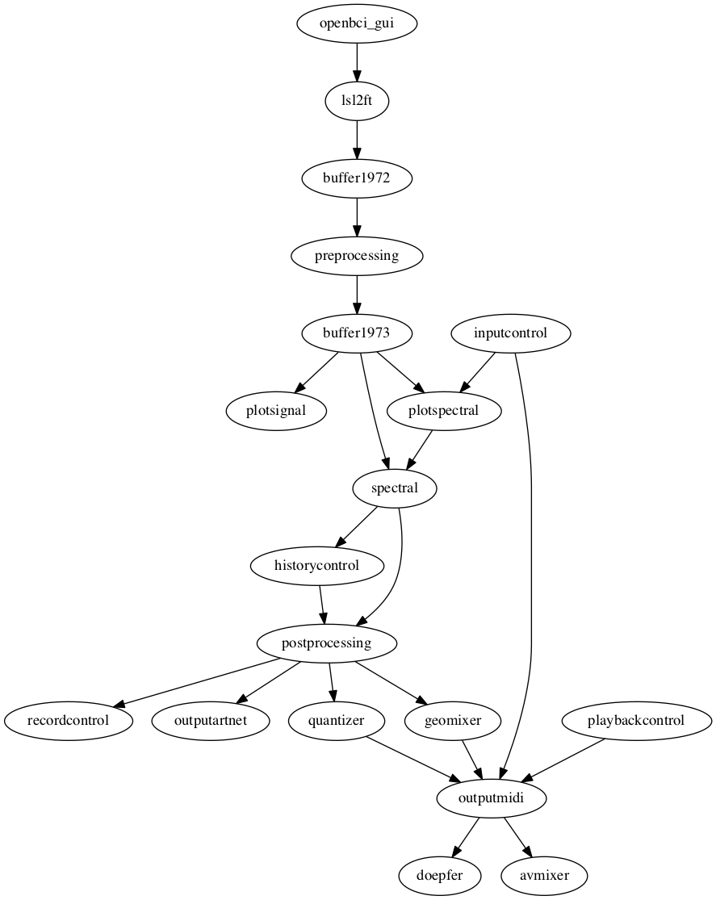

# Tradgarden

This patch uses the EEG recorded from two electrodes on the back of the head. The patch extracts the alpha amplitude envelope and uses that to control multiple outputs:

1. LED ring mounted in front of the performer for visual feedback (using `outputartnet`)
2. Control voltage from Doepfer A190-3 for modular synthesizer (using `outputmidi`)
3. Three-way video mixing with AVmixer (using `outputmidi`)

## Schematic representation of the patch

