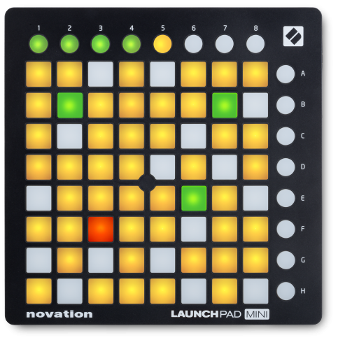
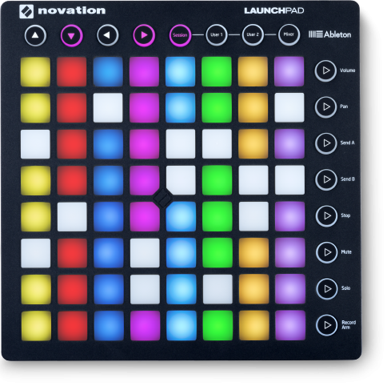

# Launchpad Module

This module processes input MIDI commands from a Novation Launchpad digital control surface. The button press and release events are sent as triggers to the Redis buffer.

For the buttons you can specify whether they should respond as push buttons (on/off) or as toggle buttons.

Push buttons are momentary, i.e. only "on" while you keep your them depressed. Toggle buttons retain their state after you release them, pressing once more switches to the next state. The following options are supported, which are also represented using the color code of the LED:

  * toggle1 buttons switch between on-off
  * toggle2 buttons switch between on1-on2-off
  * toggle3 buttons switch between on1-on2-on3-off
  * toggle4 buttons switch between on1-on2-on3-on4-off

We initially implemented this module for the MK1 and the Mini version, but have updated the code to also work on the MK2. One difference between the two is in the default MIDI assignment of the buttons, another is that the MK2 has many more colors. You should specify `model` in the ini file to get the right color values, this does not change the MIDI values.

## LaunchPad mini



## LaunchPad Mk2




## MIDI assignment

The Launchpad Mk1 and Mini have 8 rows with 8 buttons each, eight buttons (1-8) at the top, and eight buttons (A-H) on the right side. Below is the outline of the main control elements with the default MIDI codes.

```
(104) (105) (106) (107) (108) (109) (110) (111)

[000] [001] [002] [003] [004] [005] [006] [007]    (008)
[016] [017] [018] [019] [020] [021] [022] [023]    (024)
[032] [033] [034] [035] [036] [037] [038] [039]    (040)
[048] [049] [050] [051] [052] [053] [054] [055]    (056)
[064] [065] [066] [067] [068] [069] [070] [071]    (072)
[080] [081] [082] [083] [084] [085] [086] [087]    (088)
[096] [097] [098] [099] [100] [101] [102] [103]    (104)
[112] [113] [114] [115] [116] [117] [118] [119]    (120)
```

The Launchpad Mk2 has the same layout of the control elements, but with a different assignment of the default MIDI codes.

```
(104) (105) (106) (107) (108) (109) (110) (111)

[081] [082] [083] [084] [085] [086] [087] [088]    (089)
[071] [072] [073] [074] [075] [076] [077] [078]    (079)
[061] [062] [063] [064] [065] [066] [067] [068]    (069)
[051] [052] [053] [054] [055] [056] [057] [058]    (059)
[041] [042] [043] [044] [045] [046] [047] [048]    (049)
[031] [032] [033] [034] [035] [036] [037] [038]    (039)
[021] [022] [023] [024] [025] [026] [027] [028]    (029)
[011] [012] [013] [014] [015] [016] [017] [018]    (019)
```
